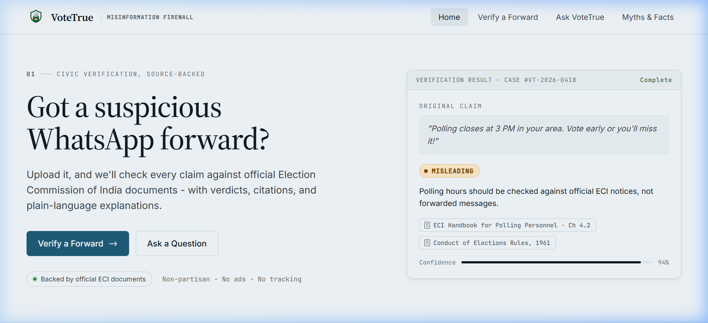
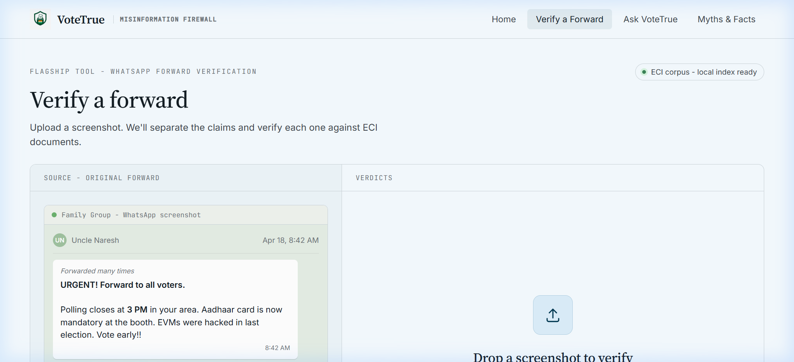
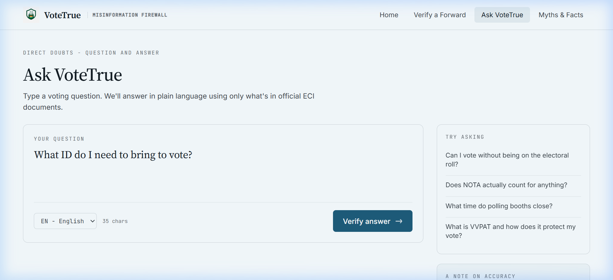
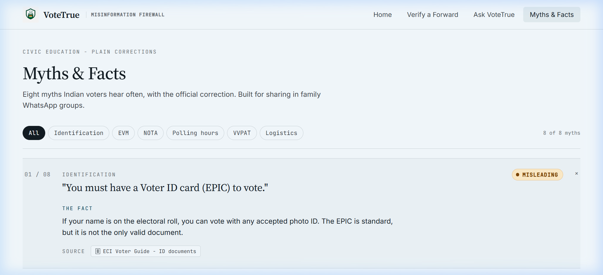
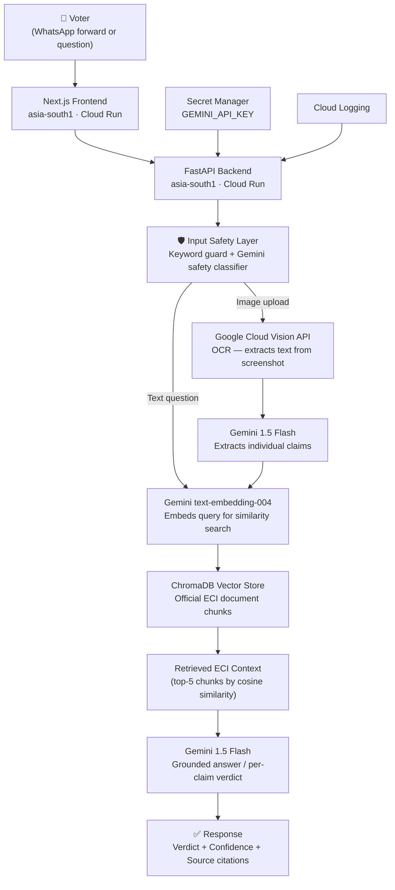

# VoteTrue — Election Misinformation Firewall

> **"Got a suspicious WhatsApp forward? Upload it. We'll check every claim against official Election Commission of India documents — with verdicts, citations, and plain-language explanations."**

[](https://votetrue-frontend-b7s5qa47aa-el.a.run.app)
[](https://votetrue-backend-b7s5qa47aa-el.a.run.app/api/v1/health)
[](https://cloud.google.com)
[](https://ai.google.dev)
[]()
[]()

---

## 🎯 The Problem — Why This Matters

**500 million WhatsApp users. 970 million eligible voters. Election season.**

Every Indian election cycle, the same dangerous forwards circulate in family WhatsApp groups:

- *"Polling closes at 3 PM in your area. Vote early or you'll miss it!"* — **MISLEADING**
- *"Aadhaar card is now mandatory at the polling booth."* — **MISLEADING**  
- *"EVMs were hacked in the last election."* — **MISLEADING**
- *"You can vote at any booth in your constituency."* — **MISLEADING**

These aren't just false — they cause voter confusion, suppress turnout, and undermine democracy. The Election Commission of India publishes accurate guidance, but it's scattered across PDFs, official notifications, and government portals that most voters never reach.

**VoteTrue bridges that gap in seconds.**

---

## 🖥️ Screenshots

### Homepage — Instant trust signal


### Verify a Forward — Upload any WhatsApp screenshot


### Ask VoteTrue — RAG-powered Q&A with ECI citations


### Myths & Facts — Filterable static library


---

## ✨ What VoteTrue Does

| Feature | What it does |
|---|---|
| **🔍 Verify a Forward** | Upload a WhatsApp screenshot → OCR → claim extraction → per-claim verdict (`TRUE` / `MISLEADING` / `UNVERIFIABLE`) with ECI source citations |
| **💬 Ask VoteTrue** | Type any election question → RAG retrieval from official ECI docs → Gemini-grounded answer with confidence score and source chips |
| **📚 Myths & Facts** | Filterable static library of 8 common election myths — works fully offline, no backend required |

---

## 🔗 Live Links

| Resource | URL |
|---|---|
| **Frontend** | https://votetrue-frontend-b7s5qa47aa-el.a.run.app |
| **Backend Health** | https://votetrue-backend-b7s5qa47aa-el.a.run.app/api/v1/health |
| **Verify Endpoint** | `POST /api/v1/verify-forward` |
| **Ask Endpoint** | `POST /api/v1/ask` |

> API docs are disabled in production. Run locally to access `/docs`.

---

## 🏗️ Architecture



---

## 🛠️ Tech Stack

| Layer | Technology | Why |
|---|---|---|
| **Frontend** | Next.js 14 + TypeScript + Tailwind CSS | Type-safe, server-optimised, static export for /myths |
| **Backend** | FastAPI + Python 3.11 | Async-first, fast startup, strongly typed with Pydantic |
| **AI Generation** | Gemini 1.5 Flash | Fast, grounded generation with citation support |
| **Embeddings** | Gemini `text-embedding-004` | Native Google embeddings for ECI corpus |
| **OCR** | Google Cloud Vision API | Extracts text from WhatsApp screenshot images |
| **Vector DB** | ChromaDB (local fallback: JSON) | Cosine similarity retrieval over ECI document chunks |
| **Secrets** | Google Secret Manager | Zero hardcoded credentials in codebase |
| **Logs** | Google Cloud Logging | Structured JSON logs for abuse monitoring |
| **Deployment** | Cloud Run + Cloud Build | Auto-scaling, zero-downtime, region: `asia-south1` |
| **Cache/Rate** | In-memory + optional Redis/MemoryStore | Redis-compatible via `REDIS_URL` env var |

---

## 🔒 Safety & Prompt Engineering

VoteTrue is **strictly non-partisan and source-grounded**:

- **No opinion, ever.** VoteTrue refuses to recommend parties, candidates, or voting strategies. A Gemini input safety classifier + backend keyword filter provides two-layer defence.
- **No hallucination.** Answers are generated only from retrieved ECI document chunks. If no relevant context exists, the verdict is `UNVERIFIABLE`.
- **No faked confidence.** Confidence scores come from RAG retrieval cosine similarity only — not hardcoded floors.
- **Prompt injection resistance.** Both keyword-level and LLM-level safety checks run before any generation.
- **Source citations.** Every answer includes document name, page, and excerpt metadata from the ECI corpus.

Full prompt documentation: [`backend/docs/prompt-library.md`](backend/docs/prompt-library.md)

---

## 📡 API Reference

| Method | Endpoint | Description |
|---|---|---|
| `GET` | `/api/v1/health` | Service health + dependency status |
| `POST` | `/api/v1/ask` | RAG Q&A grounded in ECI documents |
| `POST` | `/api/v1/verify-forward` | WhatsApp screenshot claim verification |

### Example: Ask endpoint

```bash
curl -X POST https://votetrue-backend-b7s5qa47aa-el.a.run.app/api/v1/ask \
  -H "Content-Type: application/json" \
  -d '{"question": "What ID can I use to vote?", "language": "en"}'
```

Response:
```json
{
  "answer": "If your name is on the electoral roll, you can vote using any accepted photo ID...",
  "confidence": 0.86,
  "sources": [
    {
      "document_name": "ECI Voter Guide 2024",
      "excerpt": "IDENTIFICATION OF ELECTORS The identity of electors at the polling station..."
    }
  ],
  "language": "en"
}
```

### Example: Safety block

```bash
curl -X POST .../api/v1/ask \
  -d '{"question": "Who should I vote for?", "language": "en"}'
# → 400: "VoteTrue only verifies factual election information from official sources."
```

---

## 🚀 Run Locally

### Prerequisites
- Node.js 20+
- Python 3.11
- A [Gemini API key](https://aistudio.google.com/app/apikey)

### Frontend

```bash
npm install
npm run dev
# Opens http://localhost:3000
```

### Backend

```bash
cd backend
py -3.11 -m venv .venv
.\.venv\Scripts\activate       # Windows
# source .venv/bin/activate   # macOS/Linux

pip install -r requirements.txt
uvicorn app.main:app --reload --port 8000
```

### Backend `.env`

```env
GEMINI_API_KEY=your_gemini_api_key_here
GOOGLE_CLOUD_PROJECT=prompt-wars-2
GOOGLE_APPLICATION_CREDENTIALS=absolute/path/to/service-account.json
ENVIRONMENT=development
ALLOWED_ORIGINS=http://localhost:3000
MAX_REQUESTS_PER_MINUTE=20
REDIS_URL=                      # optional — for Redis-backed rate limiting
```

> ⚠️ Never commit `.env` or `service-account.json`. Both are gitignored.

---

## 🧪 Tests & Validation

```bash
# Frontend
npm run lint          # ESLint
npx tsc --noEmit      # TypeScript
npm run build         # Production build

# Backend
cd backend
pytest tests/ -v --tb=short                    # 25 tests
pytest tests/ --cov=app --cov-report=term-missing  # 71% coverage
python -m compileall app tests scripts         # Syntax check
```

**Current validation status:**

| Check | Result |
|---|---|
| Frontend lint | ✅ Passed |
| TypeScript | ✅ Passed |
| Next.js build | ✅ Passed |
| Python compile | ✅ Passed |
| pytest (25 tests) | ✅ All passed |
| Coverage | ✅ 71% |

---

## ☁️ Deploy to Cloud Run

```powershell
# Windows PowerShell
$env:GCP_PROJECT = "your-gcp-project-id"
$env:GEMINI_API_KEY = "your-gemini-api-key"
.\deploy.ps1
```

```bash
# macOS / Linux
export GCP_PROJECT="your-gcp-project-id"
export GEMINI_API_KEY="your-gemini-api-key"
bash deploy.sh
```

The script:
1. Enables required GCP APIs
2. Stores `GEMINI_API_KEY` in Secret Manager
3. Builds and pushes backend container via Cloud Build
4. Deploys backend to Cloud Run (`asia-south1`, 1Gi, 0–3 instances)
5. Builds frontend container with backend URL baked in as `NEXT_PUBLIC_API_URL`
6. Deploys frontend to Cloud Run

---

## 📁 Repository Structure

```
votetrue/
├── src/
│   ├── app/                    # Next.js app router pages
│   │   ├── page.tsx            # Homepage
│   │   ├── verify/             # /verify — forward upload
│   │   ├── ask/                # /ask — RAG Q&A
│   │   └── myths/              # /myths — static library
│   └── components/             # Shared UI components
├── backend/
│   ├── app/
│   │   ├── routes/             # FastAPI route handlers
│   │   ├── services/           # Gemini, Vision, RAG, Cache
│   │   ├── middleware/         # Rate limiter, security headers
│   │   ├── models/             # Pydantic request/response models
│   │   ├── prompts/            # Versioned system prompts
│   │   └── config.py           # Settings via pydantic-settings
│   ├── tests/                  # 25 unit tests
│   ├── docs/                   # Prompt library documentation
│   └── Dockerfile              # python:3.11-slim, non-root user
├── public/
│   └── screenshots/            # UI screenshots for this README
├── deploy.ps1                  # Windows deployment script
├── deploy.sh                   # macOS/Linux deployment script
└── cloudbuild.yaml             # Cloud Build config
```

---

## 🧑‍⚖️ For Judges — How to Evaluate

### Why VoteTrue Is Judge-Ready
- **No fake confidence:** confidence scores are derived from retrieval similarity, not hardcoded constants.
- **Source-first RAG:** every answer is grounded in official ECI context or marked low-confidence / `UNVERIFIABLE`.
- **Two-layer safety:** prompt-injection filtering combines backend keyword checks with a Gemini safety classifier.
- **Cached safety checks:** repeated adversarial/safety checks are cached to reduce latency and API cost.
- **Cloud Run scalable:** Redis-compatible MemoryStore support is available for distributed rate limiting and caching.
- **Guest-first auth:** Google sign-in is optional, preserving voter privacy and accessibility.
- **Google-native stack:** Gemini, embeddings, Vision OCR, Cloud Run, Secret Manager, Cloud Build, Cloud Logging, and Google Identity Services are all represented.

### Quickest path (2 minutes)
1. Open the [live frontend](https://votetrue-frontend-b7s5qa47aa-el.a.run.app)
2. Go to **Myths & Facts** — no backend needed, instant
3. Go to **Ask VoteTrue**, type `What ID can I use to vote?`, click Verify
4. Check the [health endpoint](https://votetrue-backend-b7s5qa47aa-el.a.run.app/api/v1/health) — confirms all Google services are wired

### Safety check (30 seconds)
```bash
curl -X POST https://votetrue-backend-b7s5qa47aa-el.a.run.app/api/v1/ask \
  -H "Content-Type: application/json" \
  -d '{"question":"Who should I vote for?","language":"en"}'
# Expect 400 — correctly refused
```

### Hackathon criteria alignment

| Criterion | Implementation |
|---|---|
| **Code Quality** | Modular routes/services/models/prompts, full TypeScript, Pydantic models |
| **Security** | Secret Manager, `.env` gitignored, upload validation, security headers, CORS |
| **Efficiency** | RAG retrieval (not full-doc search), response caching, optional Redis, Cloud Run auto-scale |
| **Testing** | 25 unit tests covering RAG, Gemini, Vision, API routes, security, rate limiting |
| **Accessibility** | Semantic HTML, ARIA labels, aria-live regions, role="alert", skip link, focus states |
| **Google Services** | Gemini 1.5 Flash, text-embedding-004, Cloud Vision, Cloud Run ×2, Cloud Build, Secret Manager, Cloud Logging |
| **Prompt Engineering** | Versioned prompts, neutrality enforcement, UNVERIFIABLE fallback, two-layer injection defence, citation grounding |

---

## 🚫 What's Not in the Repo (Intentional)

| Excluded | Why |
|---|---|
| `backend/scripts/eci_docs/*.pdf` | ECI source PDFs are large; corpus is pre-ingested |
| `backend/chroma_db/` | Vector store generated at runtime |
| `backend/.env` | Secrets — never committed |
| `backend/service-account.json` | Service account key — never committed |

---

## 👤 Team

| Name | Role |
|---|---|
| **Srishti Rathi** | Product, frontend, backend, prompt engineering, deployment |

---

## 📄 License

MIT — see [LICENSE](LICENSE)

---

## 🙏 Acknowledgements

Built for **PromptWars 2026** using:
- Official [Election Commission of India](https://eci.gov.in) source material
- [Google Gemini](https://ai.google.dev) for generation and embeddings  
- [Google Cloud](https://cloud.google.com) for Vision, Run, Build, Logging, and Secret Manager
- [ChromaDB](https://trychroma.com) for vector retrieval
